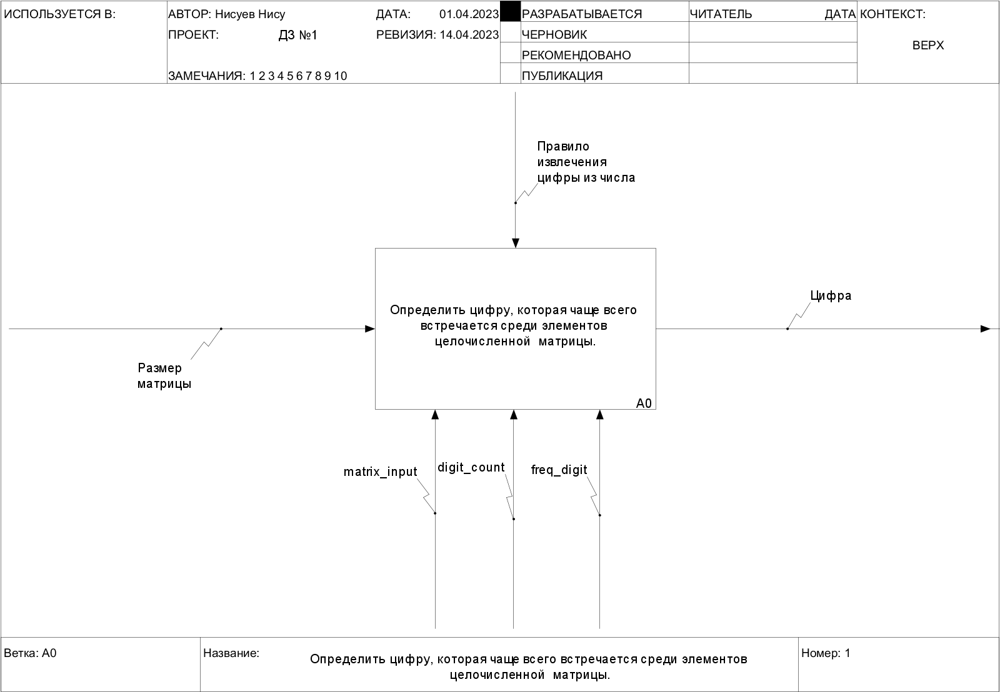
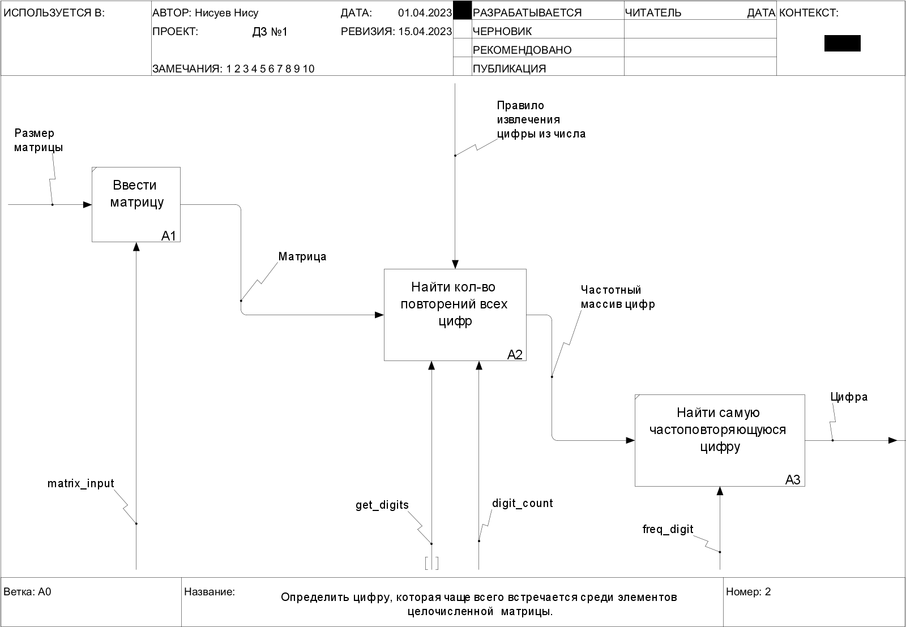
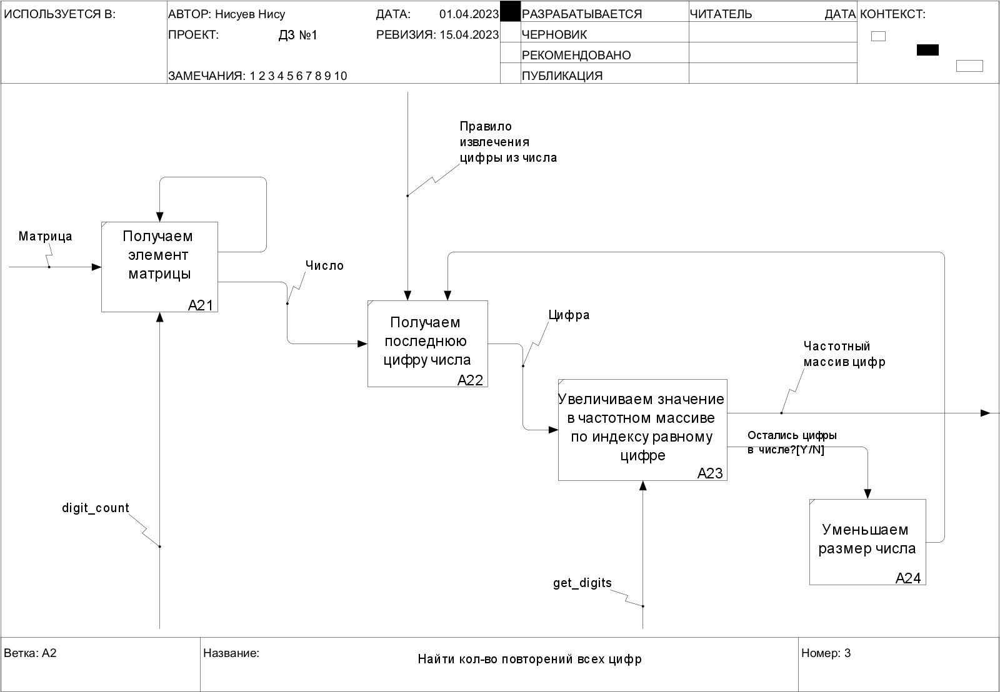

***
***

# Постановка задачи

***

## Условие 
Определить цифру, которая чаще всего встречается среди элементов целочисленной  матрицы.

***
***

## Допущения

1. Размеры матриц беззнаковые целые числа
2. Матрица состоит из целых чисел
3. Размер матрицы не больше 10х10
4. Элементы матрицы разделяются произвольным числом пробелов
5. Размер элементов матрицы ограничен целым типом
6. Если самых частовстречающихся цифр несколько берем минимальное
 
***
***

## Пример работы

|              Входные данные              |  Выходные данные   |
|:----------------------------------------:|:------------------:|
|                   2 a                    |  size input error  |
|                   0 2                    |  size range error  |
|                   -2 4                   |  size range error  |
|                   4 12                   |  size range error  |
|    2 2 <br> \| 2 a \| <br> \| 2 2 \|     | matrix input error |
|    2 2 <br> \| 1 2 \| <br> \| 3 4 \|     |       num: 1       |
|    2 2 <br> \| 2 1 \| <br> \| 3 2 \|     |       num: 2       |
|  2 2 <br> \| 20 -31 \| <br> \| 33 21 \|  |       num: 3       |
| 2 2 <br> \| 1111 3 \| <br> \| 3333 2 \|  |       num: 3       |
|  2 2 <br> \| -20 -3 \| <br> \| -1 20 \|  |       num: 0       |

***
***
***

# Декомпозиция

***

## Диограмма IDEF0





***
***

## Внешние спецификации модулей

### Модуль А1

#### Спецификация модуля

|                       |                                                                                                          |
|:---------------------:|:--------------------------------------------------------------------------------------------------------:|
|          Имя          |                                               matrix_input                                               |
|        Функция        |                                  Считывание размера и элементов матрицы                                  |
|   Список параметров   |                        Размерность матрицы, элеметы матрицы, матрица, код ошибки                         |
|    Входные данные     |                                   Размерность матрицы, элеметы матрицы                                   |
|    Выходные данные    |                                 Матрица, Размерность матрицы, Код ошибки                                 |
|   Допущения модуля    | Размер матрицы меньше 10х10 <br> Размеры матрицы - натуральные числа <br> Элементы матрицы - целые числа |
|    Внешние эффекты    |                                                   Нет                                                    |

#### Тестовые данные модуля

| Входные данные<br>Размер/\|Элементы матрицы\| |   \|Матрица\| <br> Код ошибки   |
|:---------------------------------------------:|:-------------------------------:|
|             2 2 / \|1 2 \| 1 2\|              | \|1 2 \| 1 2\| <br> err code: 0 |
|            2 2 / \| 2 a \| 2 2 \|             |           err code: 1           |

___Примечания___: <br> для тестирования данного модуля выделяется два 
класса эквивалентности: 
1. Вводятся корректные данные 
2. Вводятся некореектные данные <br>
при этом в данном классе можно выделить два подкласса:
   1. Вводятся данные выходящие за заданные пределы
   2. Вводятся некорректный тип данных

#### Псевдокод модуля

```
matrix_input

Вход: n, m – Размерность матрицы
Выход: matrix - Mатрица
       err - код ошибки

err = 0
i = 0
пока i < n делать
    пока j < m делать
        ввести el
        если el не целое число тогда
            err = 1
        иначе
            matrix[i][j] = el
        конец если
    j = j + 1
    конец пока
    i = i + 1
    j = 0
конец пока       
```

***

### Модуль А2

#### Спецификация модуля

|                       |                                                |
|:---------------------:|:----------------------------------------------:|
|          Имя          |                  digit_count                   |
|        Функция        |      Формирование частотного массива цифр      |
|   Список параметров   | Матрица, размер матрицы, Частотный массив цифр |
|    Входные данные     |            Матрица, размер матрицы             |
|    Выходные данные    |             Частотный массив цифр              |
|   Допущения модуля    |      Индекс элемента соответствует цифре       |
|    Внешние эффекты    |                      нет                       |

#### Тестовые данные модуля

|    Размер/\|Элементы матрицы\|    |    \|Частотный массив цифр\|     |
|:---------------------------------:|:--------------------------------:|
|       2 2 / \|1 2 \| 1 2\|        | \|0, 2, 2, 0, 0, 0, 0, 0, 0, 0\| |
|        1 3 / \| 3 2 13 \|         | \|0, 1, 1, 2, 0, 0, 0, 0, 0, 0\| |
| 2 3 / \| -21 1 602 \| 321 16 9 \| | \|1, 4, 3, 1, 0, 0, 2, 0, 0, 1\| |

___Примечания___: <br> для тестирования данного модуля выделяется три
класса эквивалентности:
1. В матрице цифры 
2. В матрице натуральные числа
3. В матрице целые числа

#### Псевдокод модуля

```
digit_count

Вход: matrix - Mатрица
      n, m – Размерность матрицы
Выход: dig_arr - Частотный массив цифр

dig_arr[10]
i, j = 0
пока i < n делать
    пока j < m делать
        get_digits(dig_arr, matrix[i][j])
        j = j + 1
    конец пока
    i = i + 1
    j = 0
конец пока    
```

***

### Модуль А3

#### Спецификация модуля

|                       |                                                           |
|:---------------------:|:---------------------------------------------------------:|
|          Имя          |                        freq_digit                         |
|        Функция        |          Поиск самого частоповторяющегося числа           |
|   Список параметров   |   Частотный массив цифр, самая частоповторяющаяся цифра   |
|    Входные данные     |                   Частотный массив цифр                   |
|    Выходные данные    |              Cамая частоповторяющаяся цифра               |
|   Допущения модуля    | Если самых частовстречающихся цифр несколько берем первое |
|    Внешние эффекты    |                            нет                            |

#### Тестовые данные модуля

|    \|Частотный массив цифр\|     | Цифра |
|:--------------------------------:|:-----:|
| \|0, 2, 2, 0, 0, 0, 0, 0, 0, 0\| |   1   |
| \|0, 1, 1, 2, 0, 0, 0, 0, 0, 0\| |   3   |

___Примечания___: <br> для тестирования данного модуля выделяется два
класса эквивалентности:
1. В массиве все значения разные 
2. В массиве есть совпадающий значения

#### Псевдокод модуля

```
freq_digit

Вход: dig_arr - Частотный массив цифр
Выход: pop_digit - Cамая частоповторяющаяся цифра

pop_digit = 0
max_count = dig_arr[0]
i = 1
пока i < 10 делать
    если dig_arr[i] > max_count тогда
        pop_digit = i
        max_count = dig_arr[i]   
    конец если
    i = i + 1
конец пока

Примечание max_count - кол-во повторений числа
```

***

### Модуль А24

#### Спецификация модуля A24

|                       |                                              |
|:---------------------:|:--------------------------------------------:|
|          Имя          |                  get_digits                  |
|        Функция        | Увеличивает значения частотного массива цифр |
|   Список параметров   |         Частотный массив цифр, число         |
|    Входные данные     |         Частотный массив цифр, число         |
|    Выходные данные    |            Частотный массив цифр             |
|   Допущения модуля    |                     нет                      |
|    Внешние эффекты    |                     нет                      |

#### Тестовые данные модуля A24

|   \|Частотный массив цифр\|, число    |    \|Частотный массив цифр\|     |
|:-------------------------------------:|:--------------------------------:|
| \|0, 0, 0, 0, 0, 0, 0, 0, 0, 0\|, 342 | \|0, 0, 1, 1, 1, 0, 0, 0, 0, 0\| |
| \|1, 2, 0, 0, 0, 0, 0, 0, 4, 0\|, 222 | \|1, 2, 3, 0, 0, 0, 0, 0, 4, 0\| |
|  \|1, 4, 0, 0, 0, 0, 0, 0, 4, 0\|, 5  | \|1, 4, 0, 0, 0, 1, 0, 0, 4, 0\| |
|  \|0, 0, 0, 0, 0, 0, 0, 0, 0, 0\|, 0  | \|1, 0, 0, 0, 0, 0, 0, 0, 0, 0\| |

___Примечания___: <br> для тестирования данного модуля выделяется четыре
класса эквивалентности:
1. Число состоит из разных цифр
2. Число состоит из повторяющейся цифры
3. Число состоит из одной цифры
4. Цифра 0 

#### Псевдокод модуля

```
get_digits

Вход: dig_arr - частотный массив цифр
      num – число
Выход: dig_arr - частотный массив цифр

пока num >= 0 делать
    digit = num mod 10
    dig_arr[digit] = dig_arr[digit] + 1
    num = num div 10
    если num = 0 тогда
        num = -1
    конец если
конец пока

Примечание: digit - цифра числа    
```

## Псевдокод основной программы

```
Вход: n, m - размерность матрицы
Выход: popular_digit - Mатрица
       err - код ошибки

err = 0
ввести n, m
если (n не целое число) или (m не целое число) тогда
    напечатать сообщение "size input error"
    err = 1
иначе если (0 > n или n > 10) или (0 > m или m > 10) тогда
    напечатать сообщение "size range error"
    err = 2
иначе
    err = matrix_input(matrix, n, m)
    если err = 1 тогда
        напечатать сообщение "matrix input error"
    иначе
        digit_count(matrix, n, m, dig_arr)
        popular_digit = freq_digit(dig_arr)
        напечатать popular_digit
    конец если
конец  если    
```